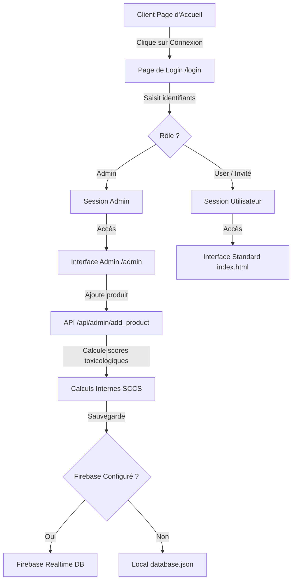

# Plan d'Implémentation : Authentification, Tableau de Bord Admin & Intégration Firebase RTDB

Ce plan décrit l'implémentation d'un système d'authentification pour les rôles Utilisateur et Administrateur, la création d'une interface d'administration permettant d'ajouter des produits avec calcul automatique des scores, et la synchronisation de ces produits avec Firebase Realtime Database (RTDB).

---

## User Review Required

> [!IMPORTANT]
> **Identifiants Administrateur par Défaut :**
> Par défaut, l'administrateur pourra se connecter avec :
> - **Nom d'utilisateur :** `admin`
> - **Mot de passe :** `admin123`
>
> Pour la production, ces identifiants pourront être configurés via des variables d'environnement (`ADMIN_USER` et `ADMIN_PASS`).

> [!IMPORTANT]
> **Configuration Firebase Realtime Database :**
> L'intégration Firebase sera configurable via la variable d'environnement `FIREBASE_DB_URL`.
> Si cette variable n'est pas définie, l'application fonctionnera en mode local en lisant et écrivant dans le fichier `database.json`. Cela garantit que l'application reste fully fonctionnelle en local sans configuration requise.

---

## Proposed Changes

Nous allons modifier le backend Flask (`app.py`), ajouter des vues HTML (`login.html` et `admin.html`), et modifier le style CSS et les scripts JS pour intégrer le flux d'authentification et l'ajout de produits.

---

### Backend Components

#### [MODIFY] [app.py](file:///c:/Users/Msi/Desktop/IsimProj/app.py)
- **Authentification & Session** :
  - Ajouter des routes `/login` (GET/POST) et `/logout` (GET).
  - Gérer les sessions utilisateur avec `flask.session`. Définir une clé secrète (`app.secret_key`).
- **Synchronisation Firebase RTDB** :
  - Ajouter une fonction helper `sync_to_firebase(path, data, method='PUT')` en utilisant le module standard `urllib.request`.
  - Modifier les routes de lecture de données (`/api/products` et `/api/ingredients`) :
    - Tenter de récupérer les données depuis Firebase RTDB si `FIREBASE_DB_URL` est configuré.
    - Sinon, lire depuis `database.json` local.
- **Route Admin d'Ajout de Produit** :
  - Ajouter la route `/admin` (GET) protégée qui affiche l'interface d'administration.
  - Ajouter la route API `/api/admin/add_product` (POST) protégée :
    - Récupère le nom, la catégorie, la référence, et la liste d'ingrédients du produit.
    - Exécute le calcul dynamique des scores toxicologiques pour chaque ingrédient.
    - Calcule la note globale et l'interprétation.
    - Enregistre le produit complet dans Firebase RTDB (et met à jour le fichier `database.json` local).

---

### Frontend Components

#### [NEW] [login.html](file:///c:/Users/Msi/Desktop/IsimProj/templates/login.html)
- Créer une page de connexion élégante et glassmorphic avec des champs Username/Password.
- Proposer une option "Continuer comme utilisateur invité" redirigeant vers la page d'accueil standard.

#### [NEW] [admin.html](file:///c:/Users/Msi/Desktop/IsimProj/templates/admin.html)
- Créer une interface d'administration complète et premium pour ajouter un nouveau produit :
  - Formulaire pour le nom, la catégorie (dropdown), la référence.
  - Liste dynamique d'ingrédients à ajouter (INCI et Concentration) avec bouton "Ajouter l'ingrédient" et "Supprimer".
  - Bouton d'enregistrement qui envoie la formulation au backend.
  - Message de succès/erreur.
- Inclure un lien de retour vers la page d'accueil standard et un bouton de déconnexion.

#### [MODIFY] [index.html](file:///c:/Users/Msi/Desktop/IsimProj/templates/index.html)
- Ajouter un bouton "Espace Admin" dans le header si l'utilisateur est connecté en tant qu'admin.
- Ajouter un bouton de connexion/déconnexion dynamique selon l'état de la session.

#### [MODIFY] [styles.css](file:///c:/Users/Msi/Desktop/IsimProj/static/css/styles.css)
- Ajouter des styles pour la page de login (champs de formulaire centrés, carte de connexion glassmorphism, etc.).
- Ajouter des styles pour l'interface admin (formulaire d'ingrédients dynamique, badges).

---

## Verification Plan

### Automated & Manual Verification
1. **Accès & Droits** :
   - Accéder à `/admin` sans être connecté -> Doit rediriger vers `/login`.
   - Se connecter avec des identifiants invalides -> Doit afficher un message d'erreur.
   - Se connecter en tant qu'administrateur -> Doit rediriger vers `/admin` (ou `/` avec accès admin).
2. **Ajout de Produit** :
   - Remplir le formulaire admin avec un produit de test contenant 2 ingrédients (ex: *Aqua* à 80% et *Glycerin* à 5%).
   - Enregistrer le produit -> Doit calculer les scores toxicologiques et l'enregistrer dans `database.json` (et dans Firebase si configuré).
   - Retourner sur l'accueil, le nouveau produit doit apparaître dans la liste déroulante et afficher le score recalculé avec succès.
3. **Validation de la base de données Firebase** :
   - Configurer une URL Firebase de test, ajouter un produit et vérifier qu'il est correctement écrit dans la Realtime Database au format attendu.
