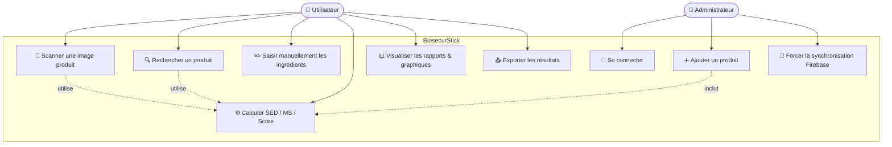
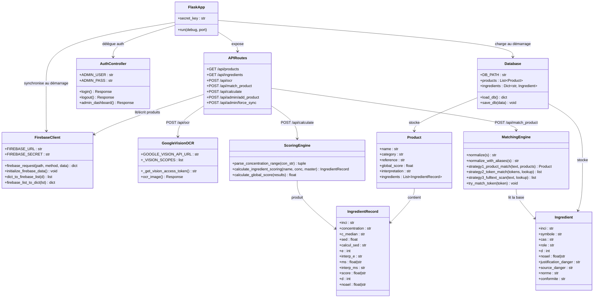
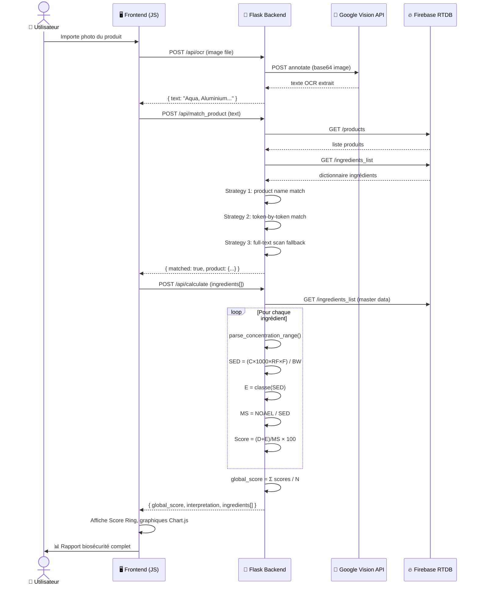
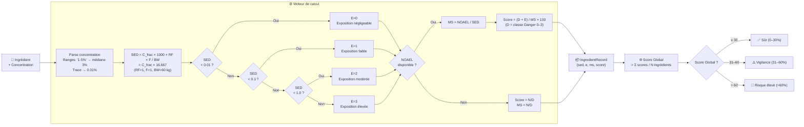

# Schémas UML & Fonctionnement — BiosecurStick

---

## 1. Diagramme de Cas d'Utilisation (Use Case)



---

## 2. Diagramme de Classes UML



---

## 3. Diagramme de Séquence — Flux OCR Complet



---

## 4. Schéma de Fonctionnement du Système

```mermaid
flowchart TD
    subgraph CLIENT["🖥️ Client — Navigateur"]
        A1[📸 Upload image] --> B1
        A2[🔍 Recherche texte] --> B2
        A3[✏️ Saisie manuelle] --> B3
        B1[OCR Handler] --> C1[/api/ocr]
        B2[Autocomplete] --> C2[/api/products]
        B3[Ingredient Editor] --> C3[/api/calculate]
        C1 --> D1[match_product]
        D1 --> C3
        C3 --> R1[Score Ring]
        C3 --> R2[Tableau détaillé]
        C3 --> R3[Graphiques Chart.js]
    end

    subgraph SERVER["🐍 Flask Backend"]
        C1 --> S1[Google Vision OCR]
        D1 --> S2[Matching Engine\nStrategy 1/2/3 + Fuzzy]
        C3 --> S3[Scoring Engine\nSED · MS · Score · Interprétation]
        S2 --> DB1[(Firebase RTDB)]
        S3 --> DB1
        DB1 --> S4[(database.json\nLocal Backup)]
    end

    subgraph ADMIN["🔐 Espace Admin"]
        ADM1[Connexion admin] --> ADM2[Dashboard admin.html]
        ADM2 --> ADM3[Ajouter produit]
        ADM3 --> S3
        ADM2 --> ADM4[Force sync Firebase]
        ADM4 --> DB1
    end

    subgraph CLOUD["☁️ Services Cloud"]
        S1 <--> GV[Google Cloud Vision API]
        DB1 <--> FB[Firebase Realtime Database\nEurope West 1]
    end

    style CLIENT fill:#0f1629,stroke:#00f2fe,color:#e2e8f0
    style SERVER fill:#0a1628,stroke:#4facfe,color:#e2e8f0
    style ADMIN fill:#1a0a28,stroke:#a855f7,color:#e2e8f0
    style CLOUD fill:#0a1a10,stroke:#22c55e,color:#e2e8f0
```

---

## 5. Schéma de Calcul — Algorithme SED / MS / Score



---

## 6. Architecture des Composants (Vue d'ensemble)

```mermaid
graph TB
    subgraph FRONT["Frontend (HTML/CSS/JS)"]
        F1[index.html\nSPA principale]
        F2[styles.css\nGlassmorphism Design]
        F3[main.js\nLogique UI + API calls]
        F4[theme.js\nDark/Light toggle]
        F5[Chart.js\nGraphiques interactifs]
        F6[Tesseract.js\nOCR fallback client-side]
    end

    subgraph BACK["Backend (Python / Flask)"]
        B1[app.py\n884 lignes]
        B2[ScoringEngine\ncalculate_ingredient_scoring()]
        B3[MatchingEngine\nmatch_product()]
        B4[OCR Handler\n/api/ocr]
        B5[Auth Controller\n/login /logout /admin]
        B6[Admin API\n/api/admin/*]
    end

    subgraph DATA["Données"]
        D1[database.json\n288 KB — produits + ingrédients]
        D2[Firebase RTDB\n/products /ingredients_list]
        D3[biosecurstick-*.json\nService Account Google]
    end

    subgraph EXTERNAL["APIs Externes"]
        E1[Google Cloud Vision API\nOCR haute précision]
        E2[Firebase Realtime Database\nEurope West 1]
    end

    F3 <-->|REST JSON| B1
    B1 --> B2
    B1 --> B3
    B1 --> B4
    B1 --> B5
    B1 --> B6
    B1 <--> D1
    B1 <--> D2
    B4 <--> E1
    D2 <--> E2
    B3 -.->|Credentials| D3
    B4 -.->|Credentials| D3
```

---

## Résumé des Routes API

| Méthode | Route | Description | Auth |
|---------|-------|-------------|------|
| `GET` | `/` | Page principale SPA | Public |
| `GET` | `/api/products` | Liste tous les produits | Public |
| `GET` | `/api/ingredients` | Dictionnaire maître ingrédients | Public |
| `POST` | `/api/ocr` | OCR image via Google Vision | Public |
| `POST` | `/api/match_product` | Matching texte OCR → ingrédients | Public |
| `POST` | `/api/calculate` | Calcul SED / MS / Score biosécurité | Public |
| `GET/POST` | `/login` | Authentification administrateur | Public |
| `GET` | `/logout` | Déconnexion session | Admin |
| `GET` | `/admin` | Dashboard d'administration | Admin 🔒 |
| `POST` | `/api/admin/add_product` | Ajout produit + calcul auto | Admin 🔒 |
| `POST` | `/api/admin/force_sync` | Force push local → Firebase | Admin 🔒 |

---

## Formules de Calcul

| Variable | Formule | Description |
|----------|---------|-------------|
| **SED** | `C_frac × 1000 × RF × F / BW` | Dose Systémique d'Exposition (mg/kg/j) |
| **E** | `Classe(SED)` | 0=négligeable, 1=faible, 2=modéré, 3=élevé |
| **MS** | `NOAEL / SED` | Marge de Sécurité |
| **Score** | `(D + E) / MS × 100` | Score de risque par ingrédient (%) |
| **Score Global** | `Σ Score_i / N` | Moyenne des scores (%) |

> **Paramètres fixes** : RF (Retention Factor) = 1.0, F (Fréquence) = 1.0, BW (Body Weight) = 60 kg  
> **Source** : Normes SCCS/1647/22 — Scientific Committee on Consumer Safety
